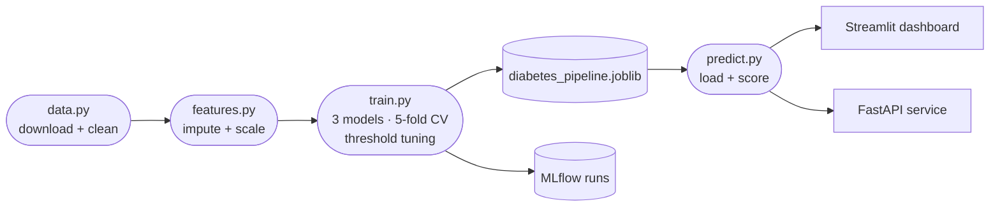

<div align="center">

# Diabetes Risk Predictor

**A primary-care screening tool, built around how clinics in Zimbabwe actually work.**
Type in the basic numbers from a clinic visit and get back a risk score that helps a nurse decide *which patients should jump the queue for a confirmatory test* — not a diagnosis, a triage.

<a href="https://nanettetada-diabetes-risk-mlops-appstreamlit-app-d1l7rc.streamlit.app/"></a>
&nbsp;
<a href="https://share.streamlit.io/deploy?repository=nanettetada%2Fdiabetes-risk-mlops&branch=main&mainModule=app%2Fstreamlit_app.py"></a>

<sub>


</sub>

<br/>


<sub><em>Hosted free on Streamlit Community Cloud — the first load can take ~30s while it wakes up.</em></sub>

</div>

---

## What this is

A small web app that takes the usual measurements from a clinic visit — glucose, BMI, blood pressure, age, a few others — and returns the probability a patient is diabetic. I built it to push past the *"look, I trained a model in a notebook"* stage and get a working thing out the other end: a cleaning step, a reproducible pipeline, a served model, a dashboard, an API, tests, and CI.

The framing is deliberately local. Zimbabwe's MoHCC puts adult diabetes prevalence around **10%**, but HbA1c testing is expensive and unevenly available across districts. A polyclinic nurse doesn't need another "diagnosis AI" — they need a way to decide **which patients deserve the limited confirmatory tests first**. Missing a diabetic is far worse than asking a healthy person back for one more test, so the model is tuned for **recall**, not raw accuracy.

> **Honest disclosure about the data.** The model is trained on the **Pima Indians Diabetes** dataset (n=768, adult women, US, 1990) — the publicly available, clinically labelled option. The Zimbabwean framing is the *use case* this demonstrates, **not** the population the model learned from. A real clinic deployment would need retraining on local data and prospective validation. Treat this as an end-to-end MLOps demonstration, not a clinically validated tool.

## The dashboard

Five screens, each telling a different part of the story.

<table>
  <tr>
    <td width="50%" valign="top">
      <p align="center"><b>Overview</b><br/><sub>The problem in plain language</sub></p>
      
    </td>
    <td width="50%" valign="top">
      <p align="center"><b>Data insights</b><br/><sub>Distributions, class balance, correlations</sub></p>
      
    </td>
  </tr>
  <tr>
    <td width="50%" valign="top">
      <p align="center"><b>Model insights</b><br/><sub>Live threshold slider, clinic-impact cost calculator, ROC + PR with the operating point, feature importance</sub></p>
      
    </td>
    <td width="50%" valign="top">
      <p align="center"><b>Try the model</b><br/><sub>Height + weight → BMI, a live risk gauge, and a counterfactual "what if" sweep</sub></p>
      
    </td>
  </tr>
  <tr>
    <td colspan="2" valign="top">
      <p align="center"><b>Run a clinic day</b><br/><sub>Drop in a patient CSV, get back a downloadable triage list sorted highest-risk first</sub></p>
      
    </td>
  </tr>
</table>

## Results

Most recent held-out test run (154 patients):

| Model | ROC-AUC | Recall | Accuracy | F1 |
|---|---|---|---|---|
| Logistic regression | 0.81 | 0.89 | 0.73 | 0.70 |
| Random forest | 0.81 | 0.85 | 0.71 | 0.67 |
| **HistGradientBoosting** *(selected)* | **0.82** | **0.91** | 0.69 | 0.67 |

The selected model has *lower* accuracy than the baseline — on purpose. I traded accuracy for recall because a missed diabetic costs far more than a false alarm.

> **Confusion matrix:** 57 true negatives · 43 false positives · **5 false negatives** · 49 true positives. Out of 154 test patients, only 5 diabetics were missed.

One honest caveat: the winning threshold landed low (~0.04), because gradient-boosted probabilities cluster near zero and the threshold has to drop to hit the recall target. The next step would be wrapping the classifier in `CalibratedClassifierCV` so the probabilities read more naturally.

## How it works



1. **Clean** — download the CSV, attach headers, and swap the placeholder zeros (a BMI or blood pressure of `0` means *missing*, not a real value) for `NaN` before anything else touches the data.
2. **Feature pipeline** — median imputation + standard scaling wrapped in a scikit-learn `Pipeline`, so the exact same transforms run at training and inference. No train/serve drift.
3. **Train** — fits three models, scores them with stratified 5-fold CV, tunes the decision threshold down until cross-validated recall hits **0.85** (`TARGET_RECALL` in `config.py`), and keeps the best ROC-AUC.
4. **Track** — every run logs to MLflow (params, metrics, fitted pipeline) so runs are comparable.
5. **Serve** — the winning model is saved to joblib; both the dashboard and the API load it from there.

## Run it yourself

```bash
git clone https://github.com/nanettetada/diabetes-risk-mlops.git
cd diabetes-risk-mlops
python -m venv .venv
.\.venv\Scripts\activate        # PowerShell

pip install -r requirements.txt
python -m diabetes_mlops.data    # download + clean
python -m diabetes_mlops.train   # train + log to MLflow
streamlit run app/streamlit_app.py
```

Serve it as an API instead:

```bash
uvicorn api.main:app --reload    # POST /predict, docs at /docs
```

Or with Docker:

```bash
docker build -t diabetes-risk . && docker run -p 8000:8000 diabetes-risk
```

CI runs pytest and a smoke training run on every push (`.github/workflows/ci.yml`).

## Project layout

```
diabetes-risk-mlops/
├── src/diabetes_mlops/   data · features · train · predict
├── app/                  Streamlit dashboard
├── api/                  FastAPI service
├── tests/                pytest
├── docs/                 methodology, model card, screenshots
├── models/               saved pipeline + metrics (generated)
├── Dockerfile · requirements.txt
└── README.md
```

## Honest disclaimers

- **Not a diagnostic tool.** It's a probability. Real-world use would need regulatory approval, prospective validation, and a clinician in the loop.
- **The training population is narrow** — women, 21+, Pima heritage. Applying it elsewhere without re-validating would be a mistake. Spelled out in [`docs/model-card.md`](docs/model-card.md).
- **No production monitoring yet** — drift detection, calibration tracking, and a feedback loop from confirmed results are all out of scope for a portfolio project, but they're what you'd want in a real clinic.

---

<div align="center">
<sub>Built by <b>Tadaishe Maumbe</b> · Harare · <a href="https://github.com/nanettetada">@nanettetada</a> · <a href="mailto:maumbetadaishe@gmail.com">maumbetadaishe@gmail.com</a></sub>
</div>
