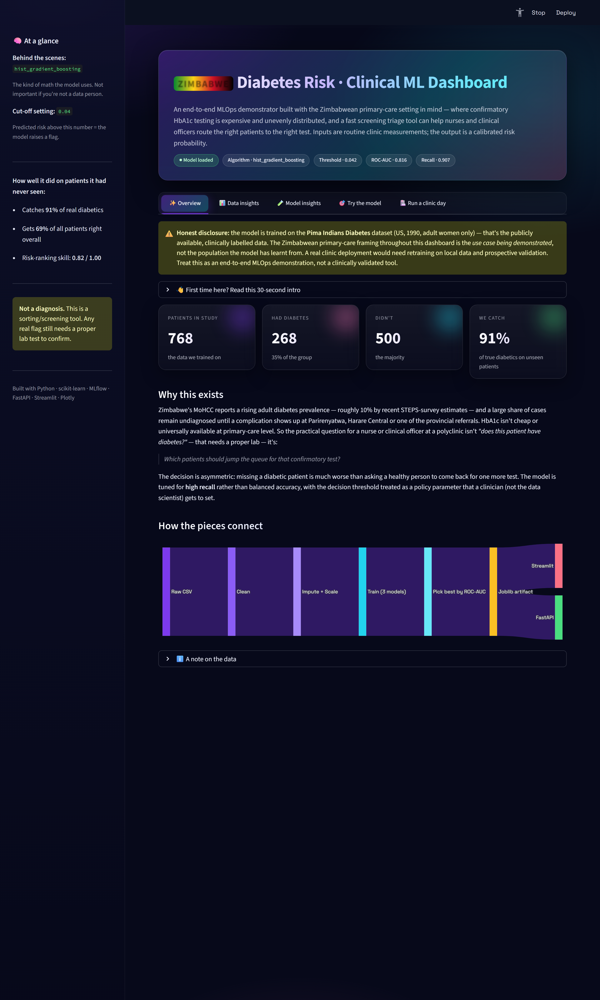
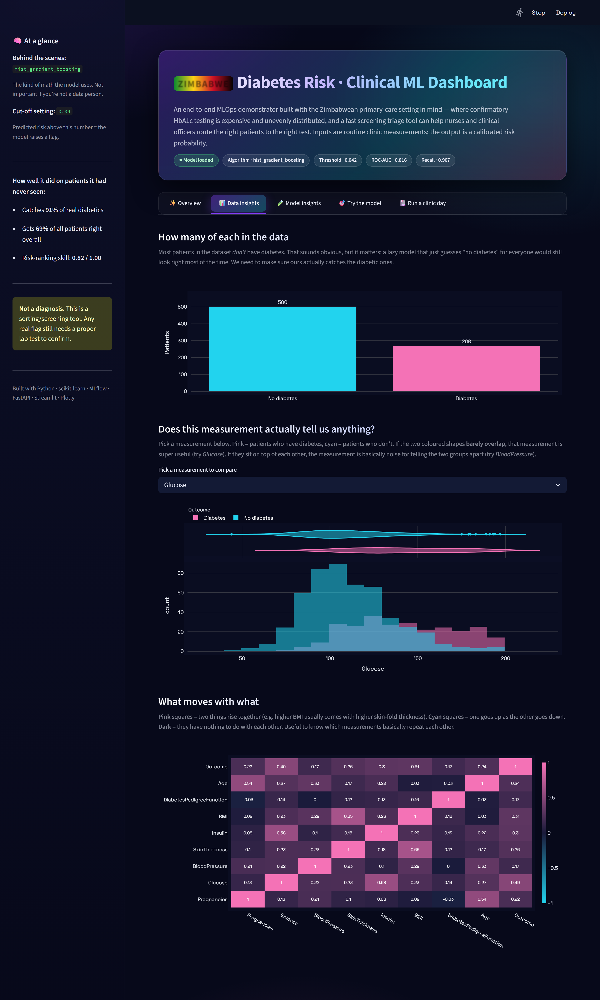
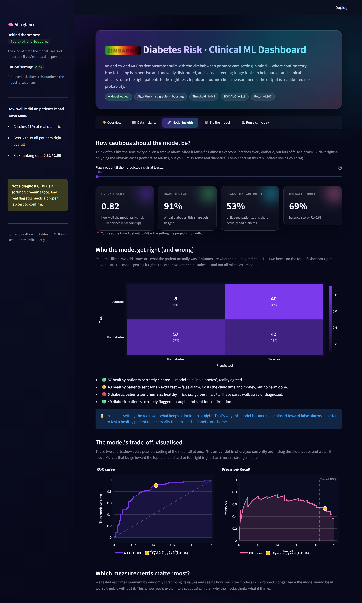
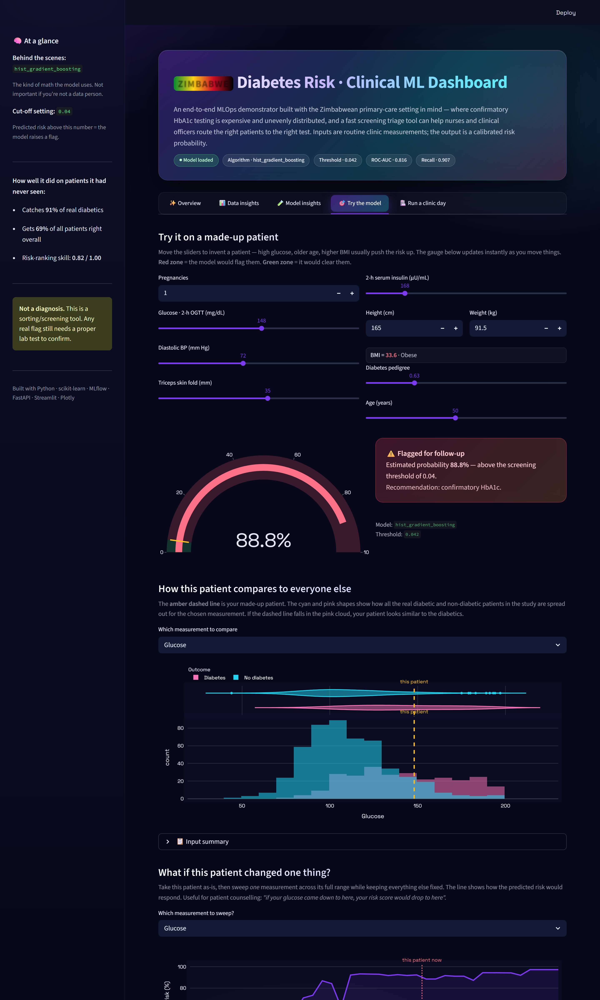
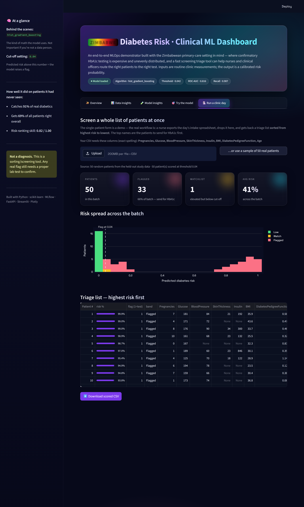
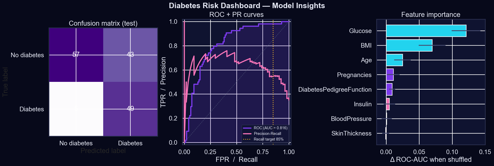
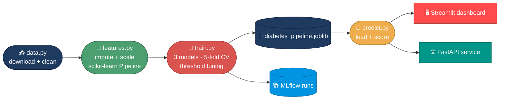

<!-- ─── Banner ─────────────────────────────────────────────────────── -->
<p align="center">
  
</p>

<!-- ─── Typing animation ───────────────────────────────────────────── -->
<p align="center">
  <a href="https://github.com/nanettetada/diabetes-risk-mlops">
    
  </a>
</p>

<!-- ─── Launch dashboard button ────────────────────────────────────── -->
<p align="center">
  
  &nbsp;
  <a href="https://share.streamlit.io/deploy?repository=nanettetada%2Fdiabetes-risk-mlops&branch=main&mainModule=app%2Fstreamlit_app.py">
    
  </a>
  &nbsp;
  <a href="#%EF%B8%8F-running-it-yourself">
    
  </a>
  &nbsp;
  <a href="docs/screenshots/">
    
  </a>
</p>
<p align="center"><sub><em>The dashboard runs locally in two minutes — see <a href="#%EF%B8%8F-running-it-yourself">Running it yourself</a> below. The deploy button spins up your own free Streamlit Cloud copy in one click.</em></sub></p>

<!-- ─── Badges ─────────────────────────────────────────────────────── -->
<p align="center">
  
  
  
  
  
  
</p>

<p align="center">
  <a href="https://github.com/nanettetada/diabetes-risk-mlops/actions">
    
  </a>
  
  
  
  <a href="https://github.com/nanettetada/diabetes-risk-mlops/stargazers">
    
  </a>
</p>

<!-- ─── Skill icons ────────────────────────────────────────────────── -->
<p align="center">
  <a href="https://skillicons.dev">
    
  </a>
</p>

<br/>

A small web app that takes the usual measurements you get at a Zimbabwean clinic visit (glucose, BMI, blood pressure, age, a few others) and gives back a probability that the patient is diabetic. The point of the project, honestly, was to push myself past the *"look I trained a model in a notebook"* stage and actually get a working thing out the other end — with an API, a UI, tests, the lot.

Built by **Tadaishe Maumbe** in Harare. I'm a Health Data Science student, and the framing here is deliberately local: Zimbabwe's MoHCC reports adult diabetes prevalence around 10% on the latest STEPS survey, but HbA1c testing remains expensive and unevenly distributed across districts. A primary-care nurse at a polyclinic doesn't need *another* "diagnosis AI" — they need a way to decide **which patients deserve the limited confirmatory tests first**. That's what this is.

> ⚠️ **Honest disclosure about the data.** The model is trained on the **Pima Indians Diabetes** dataset (n=768, adult women of the Akimel O'odham community, US, 1990) — that's what's publicly available and clinically labelled. The Zimbabwean framing is the *use case* this project demonstrates, **not** the population the model has actually learnt from. A production deployment in a Zimbabwean clinic would require retraining on local data and prospective validation. Treat everything here as an end-to-end MLOps demonstration, not a clinically validated tool.

> **Stack:** Python · scikit-learn · MLflow · FastAPI · Streamlit · Docker · GitHub Actions

---

## 📸 The dashboard

A dark-mode, glassmorphism Streamlit dashboard with interactive Plotly charts. Five tabs — each one telling a different part of the story.

<table>
  <tr>
    <td width="50%" valign="top">
      <p align="center"><b>① Overview</b><br/><sub>The problem in plain language</sub></p>
      
    </td>
    <td width="50%" valign="top">
      <p align="center"><b>② Data insights</b><br/><sub>Distributions, class balance, correlations</sub></p>
      
    </td>
  </tr>
  <tr>
    <td width="50%" valign="top">
      <p align="center"><b>③ Model insights</b><br/><sub>Live threshold slider · clinic-impact cost calculator · ROC + PR with operating point · feature importance</sub></p>
      
    </td>
    <td width="50%" valign="top">
      <p align="center"><b>④ Try the model</b><br/><sub>Height + weight → BMI · live risk gauge · counterfactual "what if" sweep</sub></p>
      
    </td>
  </tr>
  <tr>
    <td colspan="2" valign="top">
      <p align="center"><b>⑤ Run a clinic day</b><br/><sub>Drop a patient CSV, get back a downloadable triage list sorted highest-risk first</sub></p>
      
    </td>
  </tr>
</table>

<details>
  <summary><b>🔍 A closer look at the Model Insights tab</b></summary>
  <br/>
  <p align="center">
    
  </p>
  <p align="center">
    <em>Confusion matrix · ROC + PR curves with recall target · Permutation feature importance.</em>
  </p>
</details>

<p align="center">
  
</p>

## 🗂️ Table of contents

- [Why this problem](#-why-this-problem)
- [The data](#-the-data)
- [How it actually works](#%EF%B8%8F-how-it-actually-works)
- [Results](#-results)
- [Using it](#-using-it)
- [Running it yourself](#-running-it-yourself)
- [Layout](#-layout)
- [Honest disclaimers](#%EF%B8%8F-honest-disclaimers)

<p align="center">
  
</p>

## 🩺 Why this problem

Globally, type-2 diabetes is huge — over half a billion adults — and roughly **45% of cases sit undiagnosed** until a complication shows up. **In Zimbabwe** the picture is similar in shape but harder in practice: the most recent national STEPS survey puts adult prevalence at around 10%, and a large share of those people only get diagnosed when they walk into Parirenyatwa, Harare Central, or a provincial referral with retinopathy, a foot ulcer, or a cardiac event already in progress. HbA1c isn't cheap, and at the polyclinic / rural-health-centre level it isn't always available the same day.

So the question for a nurse or clinical officer doing morning intake isn't *"does this patient have diabetes?"* — that needs a proper confirmatory test. It's more like:

> *Given the basic numbers from this primary-care visit, which patients should jump the queue for that test?*

That's a screening / triage problem, and the framing matters because the cost of getting it wrong is asymmetric. **Missing a diabetic patient is much worse than asking a healthy person to come back for one more test.** I tried to bake that into the model rather than just optimising accuracy and calling it done.

<p align="center">
  
</p>

## 📊 The data

**Pima Indians Diabetes dataset** — 768 women, aged 21+, eight clinical features, binary outcome. Small and well-known, which is fine for the goal here: show the engineering around the model, not chase SOTA.

The features:

| Feature | What it is |
|---|---|
| 🤰 Pregnancies | Count of prior pregnancies |
| 🍬 Glucose | 2-hour OGTT plasma glucose |
| 🩸 BloodPressure | Diastolic, mmHg |
| 📏 SkinThickness | Triceps skin fold, mm |
| 💉 Insulin | 2-hour serum insulin |
| ⚖️ BMI | Body mass index |
| 🧬 DiabetesPedigreeFunction | Family-history score |
| 🎂 Age | Years |

> ⚠️ **One thing that's easy to miss:** several columns use a literal `0` to mean *"this measurement is missing"*. A BMI of zero or a blood pressure of zero isn't a real value — it's a placeholder. If you don't catch this, your model quietly learns that "very low BMI = high diabetes risk", which is nonsense. The cleaning step swaps those zeros for `NaN` before anything else touches the data.

<p align="center">
  
</p>

## ⚙️ How it actually works

The pipeline is broken into pieces so each one is testable on its own:



1. **Pull the data** — `src/diabetes_mlops/data.py` downloads the CSV if it isn't already on disk, attaches column headers, runs the zero-replacement.
2. **Feature pipeline** — median imputation and standard scaling, wrapped in a scikit-learn `Pipeline` so the exact same transforms run at training and at inference. No drift between what the model saw during training and what it sees in production.
3. **Train** — fits three models, scores them with stratified 5-fold cross-validation, tunes a decision threshold to meet a recall target, then keeps whichever one ends up with the best ROC-AUC.
4. **Track** — every run gets logged to MLflow (params, metrics, the fitted pipeline). Run `mlflow ui` and you can compare runs side by side.
5. **Serve** — the winning model gets saved as a joblib file, and both the API and the Streamlit dashboard load it from there.

### 🎚️ About the threshold

By default a classifier uses 0.5 to decide. For a screening tool that's almost certainly wrong. I set things up so the threshold is tuned downward (more sensitive) until cross-validated recall hits **0.85** — the policy parameter `TARGET_RECALL` in `config.py`. Change the number, retrain, both deployment surfaces pick it up automatically.

### 🧪 Models I tried

| Model | Why it's in the lineup |
|---|---|
| Logistic regression | Baseline. Coefficients are interpretable, which matters in healthcare. |
| Random forest | Non-linear, doesn't need much tuning, handles weird scales. |
| **HistGradientBoosting** ⭐ | Usually the best on tabular medical data of this size. |

The gradient-boosted one ended up winning, but only by a hair. The differences are small enough that on a different random seed any of them could have come out on top.

<p align="center">
  
</p>

## 🏆 Results

These are from the most recent local run (your numbers should be close):

| Model | ROC-AUC | Accuracy | Recall | F1 |
|---|---|---|---|---|
| Logistic regression | 0.81 | 0.73 | 0.89 | 0.70 |
| Random forest | 0.81 | 0.71 | 0.85 | 0.67 |
| **HistGradientBoosting** *(selected)* | **0.82** | 0.69 | **0.91** | 0.67 |

The accuracy on the winning model is lower than the baseline. That's intentional — I'm trading some accuracy for higher recall because missing a positive case is worse than a false alarm.

> **Confusion matrix (test set):** 57 true negatives · 43 false positives · **5 false negatives** · 49 true positives. Out of 154 test patients, only 5 diabetic ones got missed.

One thing I want to be upfront about: the winning model's decision threshold ended up quite low (around `0.04`). That happens because gradient-boosted tree probabilities tend to cluster near zero, so to hit the recall target the threshold has to drop. The numbers work, but if I were taking this further I'd wrap the classifier in `CalibratedClassifierCV` so the probabilities are easier to read.

<p align="center">
  
</p>

## 🚀 Using it

Two ways to interact with the model — same artifact, different front doors.

### 🖥️ Streamlit dashboard

Not just a prediction form — four tabs that walk through the project:

- **Overview** — the business problem in plain language
- **Data insights** — class balance, feature distributions, correlation heatmap
- **Model insights** — held-out metrics, confusion matrix, ROC + PR curves, permutation feature importance
- **Try the model** — single-patient prediction with a chart showing where that patient sits in the dataset distribution

```bash
streamlit run app/streamlit_app.py
```

### 🌐 FastAPI service

For programmatic use — if you wanted to wire it into an electronic medical record system.

```bash
uvicorn api.main:app --reload
```

Then `POST /predict` with a JSON body of the eight features, and you get back a probability and a label. Auto-generated docs at `/docs`.

### 🐳 Docker

```bash
docker build -t diabetes-risk .
docker run -p 8000:8000 diabetes-risk
```

<p align="center">
  
</p>

## ▶️ Running it yourself

```bash
git clone https://github.com/nanettetada/diabetes-risk-mlops.git
cd diabetes-risk-mlops
python -m venv .venv
.\.venv\Scripts\activate    # PowerShell
pip install -r requirements.txt

python -m diabetes_mlops.data     # download + clean
python -m diabetes_mlops.train    # train + log to MLflow
mlflow ui                          # http://127.0.0.1:5000
streamlit run app/streamlit_app.py
```

CI runs pytest and a smoke training run on every push (see `.github/workflows/ci.yml`). If it fails on your fork, that's usually a version-pin issue — open an issue and I'll look.

<p align="center">
  
</p>

## 📁 Layout

```
diabetes-risk-mlops/
├── src/diabetes_mlops/   # the library: data, features, train, predict
├── app/                  # Streamlit dashboard
├── api/                  # FastAPI service
├── tests/                # pytest
├── notebooks/            # EDA — for exploration, not the source of truth
├── docs/                 # methodology, model card, results, demo.png
├── scripts/              # build_walkthrough_doc.py, build_demo_image.py
├── models/               # saved pipeline + metrics (gitignored content)
├── mlruns/               # MLflow store
├── Dockerfile
├── requirements.txt
└── README.md
```

<p align="center">
  
</p>

## ⚖️ Honest disclaimers

- **This is not a diagnostic tool.** It's a probability. Real-world deployment would need regulatory approval, prospective validation, and a clinician in the loop.
- **The training population is narrow.** Females, 21+, Pima heritage. Applying it to males or other ethnic groups without re-validating would be a bad idea. Made explicit in [`docs/model-card.md`](docs/model-card.md).
- **No production monitoring yet.** Drift detection, calibration tracking, a feedback loop from confirmed HbA1c results — all the things you'd want if this were really in a clinic. Out of scope for a portfolio project but worth flagging.

<p align="center">
  
</p>

## 📜 License

MIT — see [`LICENSE`](LICENSE).

## 👋 Contact

**Tadaishe Maumbe** — [maumbetadaishe@gmail.com](mailto:maumbetadaishe@gmail.com)

<p align="center">
  <a href="https://github.com/nanettetada"></a>
  <a href="mailto:maumbetadaishe@gmail.com"></a>
</p>

<!-- ─── Footer banner ──────────────────────────────────────────────── -->
<p align="center">
  
</p>
